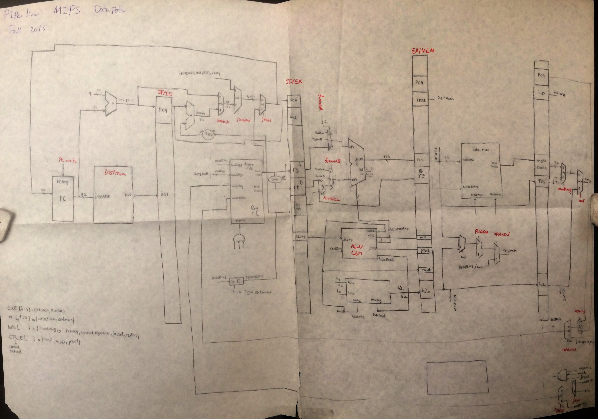

# MIPS

### 32-bit Pipeline MIPS

#### General Discription:

Verilog implementation of 32-bit pipeline MIPS with static branch prediction, which has following instructuins : 

  ADD rd,rs,rt	    Add	                        rd=rs+rt
  
  ADDI rt,rs,imm	  Add Immediate	              rt=rs+imm
  
  SUB  rd,rs,rt	    Subtract	                  rd=rs-rt
  
  OR   rd,rs,rt	    Or	                        rd=rs|rt
  
  SLT rd,rs,rt	    Set On Less Than	          rd=rs<rt
  
  SLTI rt,rs,imm	  Set On Less Than Immediate	rt=rs<imm
  
  LW rt,offset(rs)	Load Word	                  rt=*(int*)(offset+rs)
  
  SW rt,offset(rs)	Store Word	                *(int*)(offset+rs)=rt
  
  BEQ rs,rt,offset	Branch On Equal	            if(rs==rt) pc+=offset*4
  
  BNE rs,rt,offset	Branch On Not Equal	        if(rs!=rt) pc+=offset*4
  
  JAL target	      Jump And Link	              r31=pc; pc=target<<2
  
  J target	        Jump	                      pc=pc_upper|(target<<2)
  
  JR rs	            Jump                        Register	pc=rs


#### Running the test:

use a simulation environment such as Modelsim and run the test bench. By doing so, you run a buble sort program on a 32-bit MIPS which sorts 20 numbers in the data memory.

You can also write your own program machine code and change the bubble_sort.bin in the inst_mem.v to your own file. For instance, 

```
initial $readmemb("ABC.bin", instMem);
```

### 16-bit MIPS processor with 2-way L1 cache tested on Altera DE2 board

Verilog implementation of a 5 stage pipeline custom MIPS core with static branch prediction, 5-cycle memory access, 2-way L1 cache, with 1-bit LRU, and full forwarding tested on DE2 board.

#### Running the test:

You can easily write your own code in INST_ROM.v, compile the project in Quartus II, and see the result in Signal Tap. Note that you have to import DE2_pin_assignments.csv in Quartus II assignment section.

### Data path


